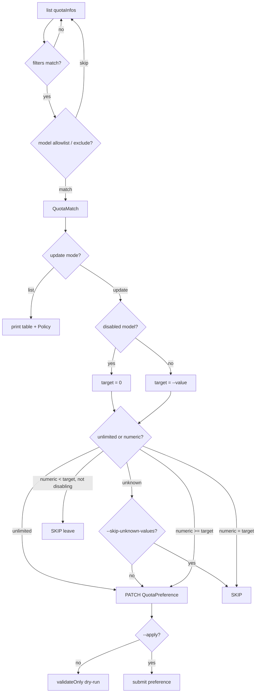

# Gemini API Quota Manager (Google Cloud)

| Field | Value |
|---|---|
| Status | Active |
| Version | 0.3.0 |
| Last updated | 2026-07-06 |
| Implementation | `gemini_quota_manager.py` (single-file `uv` script) |
| Primary scope | [`generativelanguage.googleapis.com`](https://console.cloud.google.com/apis/api/generativelanguage.googleapis.com/quotas) (Gemini API / AI Studio) |
| Console (quotas UI) | `https://console.cloud.google.com/apis/api/generativelanguage.googleapis.com/quotas?project=YOUR_PROJECT_ID` |
| Secondary scope | `aiplatform.googleapis.com` (Vertex AI only — different service) |

## Goals

- List and update Gemini-related quotas on a GCP project via the [Cloud Quotas API](https://cloud.google.com/docs/quotas/api-overview).
- Default to safe, read-only / dry-run behavior; require explicit flags to apply decreases.
- **Cap** enabled paid-tier per-model daily quotas to `--value` (default **1000**) without **raising** quotas that are already lower.
- **Disable** (quota → `0`) legacy, experimental, and explicitly blocked models via policy rules.
- Rate-limit and retry API calls so large projects don't fail mid-run on 429s.

## Non-goals

- Quota *increase* workflows beyond restoring a cap (the tool never raises a limit above its current reported value).
- Live usage / consumption metrics (reported values are **limits**, not usage).
- Billing, usage monitoring, or alerting.
- Managing non-Gemini GCP quotas unless you opt in via `--service` and `--filters`.
- Replacing the Cloud Console manual review flow when Google disables programmatic edits for a metric.

## Overview

A single-file `uv` script for managing **Gemini API** quotas via **`cloudquotas.googleapis.com`**.

| Mode | Behavior |
|---|---|
| **`list`** | Finds quotas matching `--filters` and `--models`; prints a table with **Policy** (`cap → N`, `leave → N`, `disable → 0`). |
| **`update`** | Dry-run by default (`validateOnly=true`). With `--apply`, submits `QuotaPreference` **PATCH** upserts. |

> **Argument order:** `--project` must come **before** `list` or `update`.

> **Quota values are opaque.** `--value` is in the matched metric's units (default filter = **requests per day** per model on the paid tier). Always run `list` first.

---

## 1. Supported services

**Gemini API quotas live under `generativelanguage.googleapis.com`.**

| Service | Use case |
|---|---|
| `generativelanguage.googleapis.com` | **Gemini API** (AI Studio) — **default** |
| `aiplatform.googleapis.com` | Vertex AI — only with explicit `--service` |

Default filter (display name must contain **all** of):

```text
Request limit per model per day for a project in the paid tier
```

This matches paid tier 2/3 + priority variants (~144 rows on a typical project: ~36 models × 4 quota types).

---

## 2. Prerequisites

1. **APIs enabled** on the project:
   ```bash
   gcloud services enable cloudquotas.googleapis.com generativelanguage.googleapis.com --project=YOUR_PROJECT_ID
   ```
   Or: `task setup` / `GCP_PROJECT=YOUR_PROJECT_ID task setup`

2. **IAM**

   | Mode | Role |
   |---|---|
   | `list` | `roles/cloudquotas.viewer` |
   | `update` | `roles/cloudquotas.admin` |

3. **Auth:** Application Default Credentials (`gcloud auth application-default login`). The script sets **`x-goog-user-project`** from `--project` automatically.

4. **[uv](https://docs.astral.sh/uv/)** for running the script (PEP 723 inline deps).

**API references:**

- [QuotaInfo](https://cloud.google.com/docs/quotas/reference/rest/v1/projects.locations.services.quotaInfos)
- [QuotaPreference PATCH](https://cloud.google.com/docs/quotas/reference/rest/v1/projects.locations.quotaPreferences/patch) — `allowMissing`, `validateOnly`

---

## 3. Quota value semantics

| Concept | Source / meaning |
|---|---|
| **Reported value** | `quotaInfos[].dimensionsInfos[].details.value` (fallback: `dimensionsInfo`) |
| **Unlimited** | `-1` or `Unlimited` — shown as `-1 (unlimited)` in list output |
| **Target (`--value`)** | `quotaConfig.preferredValue` on QuotaPreference (default **1000**) |
| **Unknown** | Missing / non-numeric / `n/a` — update proceeds unless `--skip-unknown-values` |

### Cap vs leave (replaces former `--min-existing-value`)

There is **no** separate `--min-existing-value` flag. Skip logic is tied to **`--value`**:

| Reported value | Enabled model | Action |
|---|---|---|
| ≥ `--value` or unlimited | yes | **Cap** down to `--value` |
| &lt; `--value` | yes | **Leave** unchanged (SKIP on update) |
| any | disabled | Set to **0** |

Quotas are **never raised** above their current reported limit.

---

## 4. Implementation

**Source of truth:** `gemini_quota_manager.py` at repo root (do not duplicate here).

### Key constants

| Constant | Default | Purpose |
|---|---|---|
| `DEFAULT_SERVICE` | `generativelanguage.googleapis.com` | API service |
| `DEFAULT_FILTERS` | paid-tier daily limit string | Display-name AND filter |
| `DEFAULT_MODELS` | `["gemini"]` | Substring allowlist on model dimension |
| `DEFAULT_CAP_VALUE` | `1000` | Default `--value` |
| `MINIMUM_GEMINI_VERSION` | `(2, 5)` | Minimum major.minor |
| `MINIMUM_GEMINI_TIER` | flash | Minimum tier (pro ≥ flash ≥ lite) |

### Model disable policy

Evaluated in order; first match → **disable → 0**:

1. **`DISABLED_MODELS`** (exact, case-insensitive):
   - `gemini-2.5-flash-native-audio-dialog`
   - `gemini-2.5-flash-preview-image`
   - `gemini-2.5-pro-1p-freebie`
   - `gemini-3.1-flash-image`
   - `gemini-3-pro-image`
2. **Suffix:** `tts`, `exp`, `lite`, `live`
3. **Substring:** `exp-*` (regex `exp-.+`)
4. **Version floor:** below **gemini-2.5-flash**
   - Parses `gemini-M` and `gemini-M.m` (e.g. `gemini-3-flash` → 3.0 flash)
   - Unversioned `gemini-*` names (e.g. embeddings) → disabled

### Typical enabled models

Policy-dependent; on project `gemini-api-80295` as of 2026-07-06:

- `gemini-2.5-flash`, `gemini-2.5-pro`
- `gemini-3-flash`, `gemini-3-pro`
- `gemini-3.1-pro`, `gemini-3.5-flash`
- Project-wide rows (no model dimension)

### API write path

```http
PATCH /v1/projects/{project}/locations/global/quotaPreferences/{id}?allowMissing=true&validateOnly={true|false}
```

Uses **PATCH** (not POST create) — `validateOnly` and `allowMissing` are only valid on PATCH.

Before updating, the script **lists existing QuotaPreferences** and reuses the server’s resource name when `(service, quotaId, dimensions)` already match. This avoids `400 … already exist` when Console or a prior run created the preference under a different ID.

---

## 5. Usage

```bash
# Discover quotas (always first)
./gemini_quota_manager.py --project YOUR_PROJECT_ID list

# Policy column with explicit cap preview
./gemini_quota_manager.py --project YOUR_PROJECT_ID list --value 1000

# Dry-run update (validateOnly=true)
./gemini_quota_manager.py --project YOUR_PROJECT_ID update --ack-decrease-risks

# Apply
./gemini_quota_manager.py --project YOUR_PROJECT_ID update \
  --ack-decrease-risks --apply

# Custom cap
./gemini_quota_manager.py --project YOUR_PROJECT_ID update \
  --value 1000 --ack-decrease-risks --apply

# Exclude models
./gemini_quota_manager.py --project YOUR_PROJECT_ID list \
  --exclude-models gemini-2.0-flash

# Skip unknown reported values on update
./gemini_quota_manager.py --project YOUR_PROJECT_ID update \
  --skip-unknown-values --ack-decrease-risks --apply
```

> `update` without `--ack-decrease-risks` (or both long-form safety flags) exits **1** before any API call.

**Idempotency:** Re-running `update --apply` with the same `--value` upserts the same `QuotaPreference`. Rows skipped (`leave`, `at target`) are not written.

---

## 6. Update flow



**Ctrl+C** during the update loop: prints partial summary, exit **130**.

---

## 7. Design notes

- **dimensionsInfos vs dimensionsInfo:** API field is `dimensionsInfos`; script prefers it with fallback.
- **Model allowlist:** `--models` uses **substring** match (`gemini` matches all gemini-* dimensions).
- **Project-wide quotas:** rows without a model dimension bypass disable rules; Policy = `cap → --value`.
- **Rate limiting:** token bucket `--rps` (default 4), `--burst`, exponential backoff on 429/5xx.
- **Decrease safety:** `--ack-decrease-risks` sets both `ignoreSafetyChecks` values on PATCH.
- **Preference ID:** max 63 chars; long IDs truncated with SHA-256 suffix.
- **List table:** Reported value `-1` displayed as `-1 (unlimited)`.

### Glossary

| Term | Meaning |
|---|---|
| QuotaInfo | Read-only metadata + per-dimension reported limits |
| QuotaPreference | Requested target (`preferredValue`) for a quota + dimensions |
| Policy | Per-row intended action: `cap`, `leave`, or `disable` |
| Dry-run | `update` without `--apply` (`validateOnly=true`) |

---

## 8. Operational behavior

### Exit codes

| Code | Meaning |
|---|---|
| `0` | Success |
| `1` | Fatal error (auth, API, missing ack, argparse) |
| `2` | Partial failure (one or more writes failed) |
| `130` | Interrupted (Ctrl+C during `update`) |

### End-of-run summary

```text
Summary: N applied/validated, N disabled (→0), N skipped (at target/below cap), N skipped (unknown value), N failed.
```

---

## 9. Acceptance criteria

| # | Scenario | Expected |
|---|---|---|
| 1 | `list` with defaults | Matching quotas with Policy column |
| 2 | `update` without `--apply` | `validateOnly=true`; no persistent change |
| 3 | Enabled model, reported `500`, `--value 1000` | SKIP (leave); no write |
| 4 | Enabled model, reported `50000`, `--value 1000` | Cap to 1000 |
| 5 | Reported `-1` / unlimited, enabled | Cap to `--value`; not skipped |
| 6 | Disabled model (suffix / denylist / version) | Target 0 |
| 7 | `update` without ack flags | Exit 1 before API calls |
| 8 | Partial write failure | Exit 2 |
| 9 | `--skip-unknown-values`, reported `n/a` | SKIP |
| 10 | Ctrl+C mid-update | Partial summary; exit 130 |
| 11 | QuotaPreference write | PATCH with `allowMissing=true` |

---

## 10. Troubleshooting

| Symptom | Likely cause | Action |
|---|---|---|
| `401 UNAUTHENTICATED` | Missing/expired ADC | `gcloud auth application-default login` |
| `403 PERMISSION_DENIED` | IAM or API not enabled | Enable APIs; grant viewer/admin |
| `403` quota project | Old script | Use current script (`x-goog-user-project` from `--project`) |
| `400` preference already exists | PATCH used generated ID; preference exists under another name | Fixed: script lists preferences and reuses existing resource name |
| Empty `list` | Filters too narrow | Broaden `--filters`; check Console |
| Unexpected SKIP | Below cap or disabled | Run `list`; read Policy column |
| Update 2xx, value unchanged | Pending review | Check Console quotas page |
| Exit `2` | Partial failures | Re-run `list`; inspect FAILED lines |
| Exit `130` | User interrupt | Re-run; completed rows already applied if `--apply` was used |
